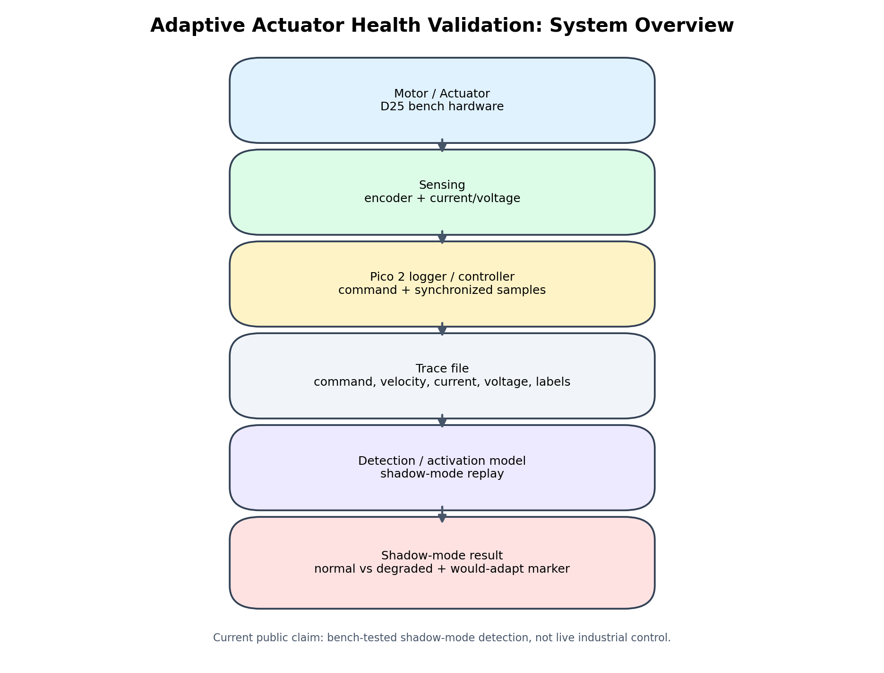
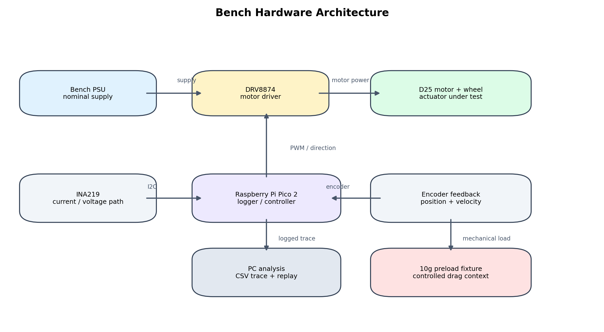
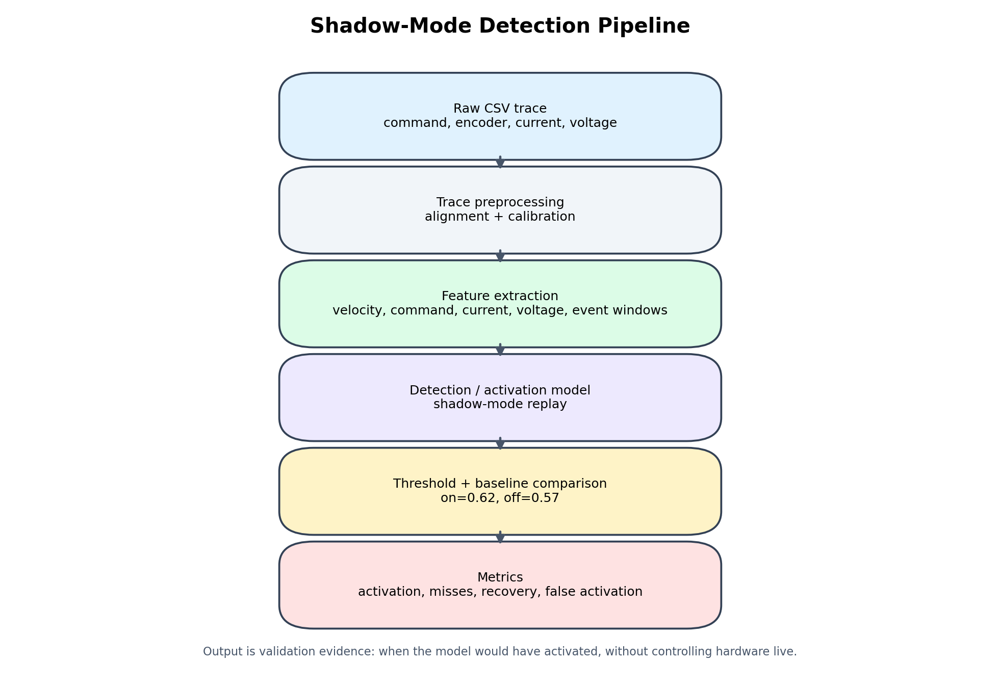
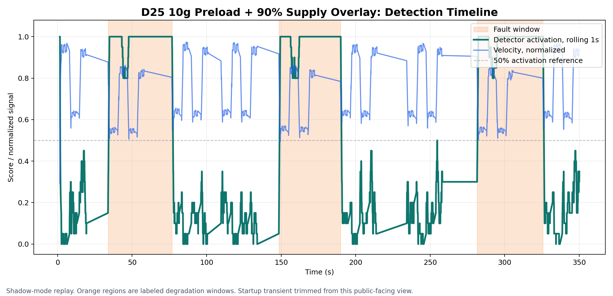
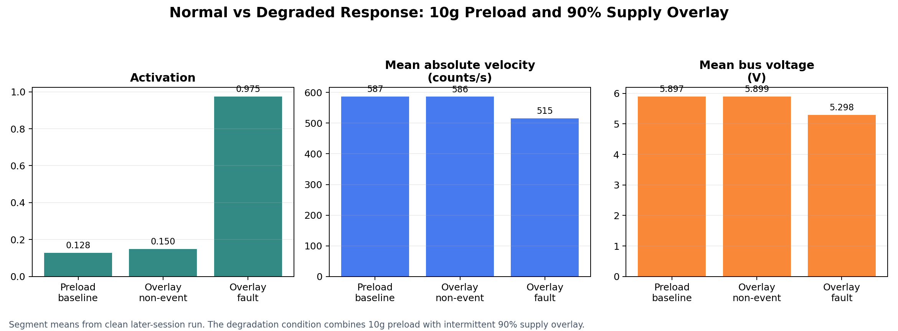
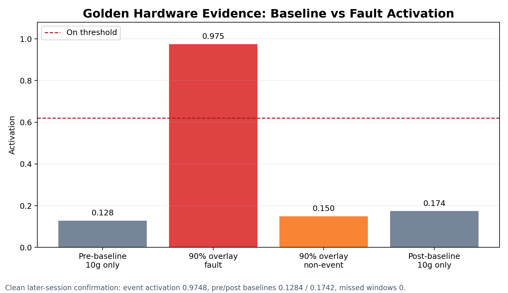

# Adaptive Actuator Health Validation

Bench-tested actuator fault-detection research for identifying motor drag,
power sag, and degraded movement from command, encoder, current, and voltage
traces.

This public repository is intended for project documentation, market discovery,
and technical discussion. Code, private datasets, and hardware design files are
not currently released.

## Current Status

This project is a bench-tested prototype for actuator health monitoring and
adaptive-control validation under controlled test conditions.

The current focus is **shadow-mode detection**:

- Observe actuator behavior.
- Compare commanded movement against measured response.
- Identify degradation-like events.
- Evaluate when an adaptive controller would have activated.
- Keep live hardware control out of scope until validation is stronger.

This is not currently an industrial-ready controller, safety-certified product,
field-deployed predictive maintenance system, or production adaptive-control
product.

## Problem

Small robotics and motorized systems can degrade or behave incorrectly for many
reasons:

- Mechanical drag.
- Bearing or gearbox friction.
- Belt tension changes.
- Voltage sag.
- Current limits.
- Motor heating.
- Degraded motor response.
- Load changes.
- Controller mismatch.

These issues can be difficult to diagnose from one signal alone. A motor may
still move, but move slower, less consistently, or with a different electrical
or motion signature than expected.

## Prototype Approach

The prototype records synchronized actuator traces such as:

- Motor command / PWM.
- Encoder position.
- Estimated velocity.
- Current draw.
- Supply voltage.
- Controlled fault or degradation labels during bench tests.
- Detection / activation score.

The core validation question is:

```text
Given what the actuator was commanded to do, does the measured behavior look
nominal or degraded?
```

System Overview



Bench Hardware Architecture



Shadow-Mode Detection Pipeline



The current prototype is focused on detecting controlled degradation in shadow
mode. It observes and scores behavior, but does not directly control hardware
live.

## Current Bench Evidence

The strongest current evidence is from a controlled D25 DC motor bench setup
using a repeatable 10g mechanical preload fixture and intermittent supply
degradation.

Validated test scope:

- D25 DC gearmotor bench hardware.
- DRV8874 motor driver.
- Raspberry Pi Pico 2 logging/control.
- Encoder-based movement traces.
- Current/voltage sensing path under evaluation.
- Horizontal motor orientation.
- 10g mechanical preload.
- Intermittent 90% supply-overlay degradation.
- Offline/shadow-mode detection validation.

Activation score is a model output in the range 0-1, where higher values
indicate stronger fault/degradation detection.

Visual Bench Evidence

The figures below show the current strongest public-facing bench result: a D25
motor test with a 10g preload and intermittent 90% supply-overlay degradation.
The important behavior is the full sequence: low baseline activation, high
activation during labeled degradation windows, and return toward lower activation
after recovery.

Detection Timeline



The orange regions mark labeled degradation windows. The detector activation
rises during the degradation windows and returns toward lower activation during
non-event and recovery periods. The velocity trace is normalized for visual
comparison.

Normal vs Degraded Response



This comparison summarizes segment-level behavior from a clean later-session
run. The degradation condition combines the 10g preload with intermittent 90%
supply overlay.

Compact Metrics Visualization



The compact metrics figure visually summarizes the same key behavior reported in
the table below: low activation during preload-only baseline, strong activation
during the 90% overlay fault window, and low activation again after recovery.
Golden metrics:

| Metric | Result |
| --- | ---: |
| Same-session 90% supply-overlay event activation | 0.9795 mean / 0.9782 min |
| Same-session missed fault windows | 0 |
| Same-session incomplete closes | 0 |
| Clean later-session 90% supply-overlay event activation | 0.9748 |
| Clean later-session pre-baseline activation | 0.1284 |
| Clean later-session post-baseline activation | 0.1742 |

Under these controlled bench conditions, the prototype stayed relatively quiet
under mild mechanical preload, strongly activated when intermittent supply
degradation was added, and returned toward low activation after the fault
condition was removed.

These results are early bench results, not field validation.

## Other Bench-Tested Scenarios

The broader evidence set includes:

- Horizontal mechanical friction / drag detection.
- D25 supply sag detection.
- Intermittent supply/load recovery checks.
- Weak-boundary 95% supply-overlay checks.
- Shorter-window 90% overlay checks.
- N20 motor friction traces with setup caveats.
- Simulation-backed regression and robustness checks.

## Demo Scenario

A typical bench demonstration uses:

1. Clean or mild-preload baseline.
2. Controlled mechanical preload or drag.
3. Voltage or supply-sag-style degradation.
4. Detection / activation response.
5. Recovery after returning to nominal conditions.
6. Clean baseline before and after the fault test.

The most important demo behavior is not just activation during a fault. It is
the full sequence:

```text
low baseline -> high activation during degradation -> return toward low activation after recovery
```

## Development Path

The long-term goal is an adaptive actuator control layer for validated
degradation scenarios.

Development stages:

1. Monitor.
2. Validate.
3. Shadow-control.
4. Advisory-control.
5. Live adaptive control.

The current prototype is focused on stages 1 and 2.

## Current Limitations

This project has not yet validated:

- Industrial field deployment.
- All motor types.
- All orientations.
- Safety-critical control.
- Closed-loop production control.
- Remaining-useful-life forecasting.
- General predictive maintenance claims.
- Live adaptive control on customer hardware.

The current strongest claim is intentionally narrower:

```text
Bench-tested actuator fault-detection prototype with real-hardware
evidence for controlled motor drag and power-delivery degradation.
```

## Market Discovery

I am looking for feedback from people working with:

- Small robotics systems.
- Motorized equipment.
- Automation prototypes.
- University robotics or controls labs.
- Actuator test rigs.
- DC motor, servo, or small motion-control systems.

Questions I am trying to answer:

- Would detecting motor drag, power sag, or degraded movement before failure be
  useful in your system?
- What data can your system realistically provide: encoder, current, voltage,
  PWM command, logs, or something else?
- What is worse in your context: a false alarm or a missed fault?
- Would a shadow-mode validation tool be useful before live adaptive control is
  deployed?
- What actuator fault would be most valuable to detect first?

## What I Am Looking For

At this stage, I am not asking organizations to deploy a product.

I am looking for:

- Short technical feedback conversations.
- Information about common actuator faults.
- Input on what motor data is realistically available.
- Feedback on whether the current demo scenario is relevant.
- Possible future collaborators or beta testers for controlled,
  non-safety-critical experiments.

## Contact

If you work with motorized systems, robotics, actuator diagnostics, or adaptive
control and are open to giving feedback, please contact:

**Jack Smith**  
jlogan12131@gmail.com

## Repository Scope

This repository is for project documentation and market-discovery purposes.

Code, hardware designs, and datasets are not currently released under an
open-source license.
